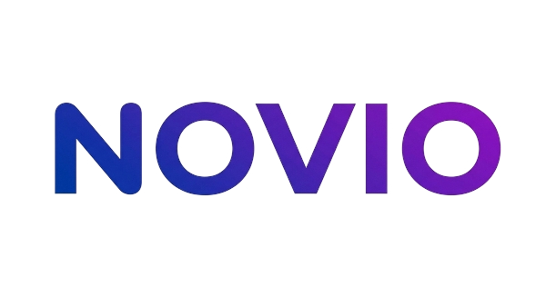

<p align="center">
  
</p>

<p align="center">
  <strong>Premium Online Tech Courses Platform</strong><br>
  Master in-demand tech skills with expert-led courses
</p>

<p align="center">
  <a href="https://ahmershahdev.github.io/novio/">Live Demo</a> &bull;
  <a href="#features">Features</a> &bull;
  <a href="#tech-stack">Tech Stack</a> &bull;
  <a href="#pages">Pages</a> &bull;
  <a href="#getting-started">Getting Started</a>
</p>

---

## About

Novio is a premium online tech courses platform designed to empower learners worldwide with industry-expert instruction. It features a modern, responsive storefront with course discovery, filtering, cart management, and user account features — all built as a static frontend with localStorage-based persistence.

## Features

- **200+ Premium Courses** — Web Development, Data Science, AI/ML, Cybersecurity, Cloud Computing, DevOps, Design, and more
- **Smart Course Discovery** — Category filters, level filters, price filters, duration filters, and real-time search with suggestions
- **Horizontal Category Scrollbar** — Quick-access category chips with horizontal scrolling on the courses page
- **Shopping Cart** — Full cart management with localStorage persistence and checkout flow
- **User Authentication** — Login, signup, forgot password with password strength meter
- **Account Dashboard** — Profile management, enrolled courses, achievements, social links, resume upload
- **Responsive Design** — Fully mobile-first with redesigned hamburger menu featuring quick links and social media
- **Premium UI** — Gradient buttons, smooth animations, glassmorphism navbar, testimonial carousel with 15 reviews
- **SEO Optimized** — Unique meta titles/descriptions, Open Graph, Twitter Cards, JSON-LD structured data on every page, sitemap.xml, robots.txt
- **Accessibility** — ARIA attributes on all forms, navigation, landmarks, and interactive elements
- **Performance** — Deferred script loading, lazy-loaded images, CSS architecture split into 16 modular files
- **Form Validation** — Regex patterns, min/max length, input types, and autocomplete attributes on all form fields

## Tech Stack

| Technology       | Usage                                    |
| ---------------- | ---------------------------------------- |
| HTML5            | Semantic markup, ARIA, JSON-LD           |
| CSS3             | Custom properties, animations, gradients |
| Bootstrap 5      | Grid, components, responsive utilities   |
| Bootstrap Icons  | Icon library                             |
| JavaScript (ES5) | DOM manipulation, localStorage           |
| jQuery 3.7.1     | Event handling, UI interactions          |

## Project Structure

```
novio/
├── index.html                  # Homepage
├── courses.html                # Course catalog with filters
├── course-detail.html          # Individual course page
├── login.html                  # Login page
├── signup.html                 # Registration page
├── forgot-password.html        # Password recovery
├── account.html                # User dashboard
├── my-courses.html             # Enrolled courses
├── cart.html                   # Shopping cart
├── payment.html                # Checkout page
├── about.html                  # About Novio
├── contact.html                # Contact form
├── blog.html                   # Blog articles
├── careers.html                # Job openings
├── catalog.html                # Full course catalog
├── novio-plus.html             # Subscription plan
├── help-center.html            # FAQ & support
├── settings.html               # Account settings
├── achievements.html           # Certificates & badges
├── purchases.html              # Order history
├── updates.html                # Notifications
├── podcast.html                # The Novio Podcast
├── tech-blog.html              # Engineering blog
├── press.html                  # Press center
├── investors.html              # Investor relations
├── leadership.html             # Leadership team
├── learners.html               # For learners
├── partners.html               # Partnerships
├── beta-testers.html           # Beta program
├── affiliates.html             # Affiliate program
├── privacy-policy.html         # Privacy policy
├── terms-of-service.html       # Terms of service
├── refund-policy.html          # Refund policy
├── accessibility.html          # Accessibility statement
├── sitemap.xml                 # XML sitemap
├── robots.txt                  # Robots directives
└── assets/
    ├── css/
    │   ├── variables.css       # CSS custom properties
    │   ├── base.css            # Base styles & buttons
    │   ├── navbar.css          # Navigation & mobile menu
    │   ├── hero.css            # Hero sections
    │   ├── courses.css         # Course cards & sections
    │   ├── components.css      # Testimonials, toasts, etc.
    │   ├── pages-auth.css      # Auth page styles
    │   ├── pages-browse.css    # Courses page, filters
    │   ├── pages-legal.css     # Legal page styles
    │   ├── pages-course.css    # Course detail styles
    │   ├── pages-account.css   # Account page styles
    │   ├── animations.css      # Keyframes & transitions
    │   ├── layout-search.css   # Search overlay styles
    │   ├── layout-footer.css   # Footer styles
    │   ├── layout-menus.css    # Dropdown & mega menu
    │   ├── responsive.css      # Media queries
    │   └── bootstrap.min.css   # Bootstrap 5
    ├── images/
    │   ├── favicon/            # Favicon files
    │   └── logo/               # Logo assets
    └── js/
        ├── data.js             # Course data (coursesData array)
        ├── utils.js            # Auth, cart, toast utilities
        ├── ui.js               # Scroll, carousel, animations
        ├── courses.js          # Course rendering & filtering
        ├── course-detail.js    # Course detail page logic
        ├── cart-page.js        # Cart & payment logic
        ├── auth-forms.js       # Login, signup, forgot password
        ├── account.js          # Account dashboard
        ├── animations.js       # Typing effect & scroll animations
        ├── nav-search.js       # Navbar search suggestions
        └── bootstrap.bundle.min.js
```

## CSS Architecture

The CSS is split into **16 modular files** for maintainability:

- **variables.css** — Design tokens (colors, spacing, typography, shadows)
- **base.css** — Reset, global styles, premium button/link styles
- **navbar.css** — Navigation bar, mobile menu, button overrides
- **hero.css** — Hero banner, gradient text, trusted companies
- **courses.css** — Course cards, category cards, step cards, stat items
- **components.css** — Testimonials, carousel, toast notifications
- **pages-\*.css** — Page-specific styles (auth, browse, legal, course, account)
- **layout-\*.css** — Layout components (search, footer, menus)
- **animations.css** — Keyframe animations and transitions
- **responsive.css** — All media queries in one place

## localStorage Schema

| Key                 | Type   | Description                                                 |
| ------------------- | ------ | ----------------------------------------------------------- |
| `novio_users`       | Array  | Registered user accounts                                    |
| `novio_user`        | Object | Currently logged-in user                                    |
| `novio_cart`        | Array  | Cart items (id, title, image, price, instructor)            |
| `novio_enrollments` | Array  | Enrolled courses (id, title, image, enrolledDate, progress) |

## Getting Started

1. Clone the repository:
   ```bash
   git clone https://github.com/ahmershahdev/novio.git
   ```
2. Open `index.html` in a browser or serve with any static server:
   ```bash
   npx serve .
   ```
3. No build step required — pure HTML, CSS, and JavaScript.

## Browser Support

- Chrome 90+
- Firefox 90+
- Safari 15+
- Edge 90+

## License

This project is proprietary. See [LICENSE](LICENSE) for details.

## Author

**Syed Ahmer Shah**

- LinkedIn: [syedahmershah](https://www.linkedin.com/in/syedahmershah)
- GitHub: [ahmershahdev](https://github.com/ahmershahdev)
- Website: [ahmershah.dev](https://ahmershah.dev)
- Email: syedahmershahofficial@gmail.com
